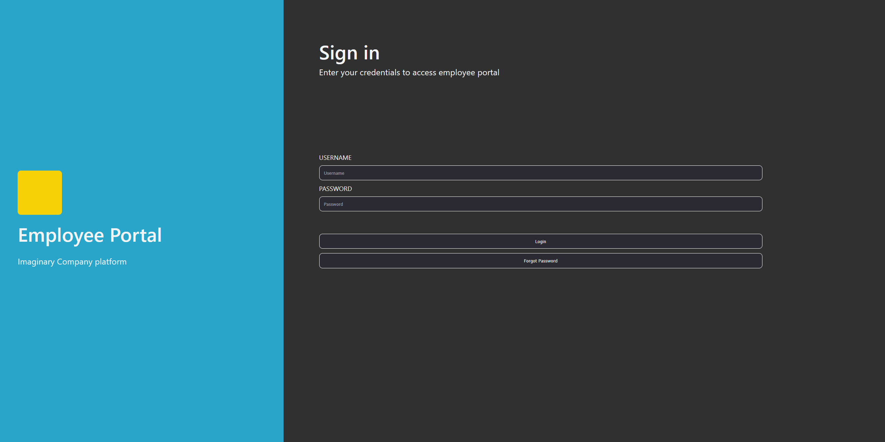

# Employee Portal Project
This is a full-stack employee portal built using React, Node.js and PostgreSQL.

https://lewis-smith-employee-portal.netlify.app/login

)

# How To Use?
## Logging In
Log-in details are saved on a database and are encrypted. If you enter a correct email and password, you are then taken to the portal home page. There is a header allowing the user to visit all of the different pages. There are also extra pages that only admin users can visit, and this is authenticated by checking if the user has the admin role in the database. This is a secure way of checking as the database is unmodifiable for a possible attacker. 
For the purposes of this demo, there are two logins available: 
| Email                   | Password         | Role     |
|-------------------------|------------------|----------|
| lewissmith@example.com  | TempPassword123! | Admin    |
| ceryshughes@example.com | SplimFlim123!    | Employee |

# Tech Stack
To make this application, I have used React, Vite, Node.js, Express, PostgreSQL, Neon, Render and Netlify.

## React / Vite
I used React for the front-end as I want to practise it and I do have experience using it, but want to get better. Vite keeps things simple with it's scaffolding and dev server. It makes it really easy to see my changes in real-time without the entire web page refreshing each time. It is also very easy to configure and allowed me not to worry about spending ages setting up the front-end.

## Node.js / Express
I used Node.js and Express for my back-end as it pairs well with React. Using them both gives me a lightweight backend, and this paired with React is perfect for creating single-page applications, which an employee portal would do well to impliment. Express allows me to define routes and handle requests really easily, which provides me with the back-end functionality I needed for this project. Node.js also pairs well with React as it means I have a single language for my front-end and back-end. As this is my first full-stack project, I opted for this simplicity while I learn the basics of full-stack development, and I think using Node.js and Express really helped this.

## PostgreSQL / Neon
PostgreSQL is my relational database of choice as it suits my needs well. It works well with Node.js as it supports async, callbacks and promises. I needed to use a relational database rather than a NoSQL database since my data that I am storing needs to have relationships, and I was able to use PostgreSQL easily by hosting it on Neon.

## Netlify / Render
I used Netlify to host my front-end because the free tier fully supported my needs for this project, and I wanted to use something that wasn't GitHub Pages. I used Render to host the back-end foir the same reason, except I had never hosted a back-end project before, but Render was very easy to use for my purposes, and the drawbacks of the free tier shouldn't matter for a project of this scale.
